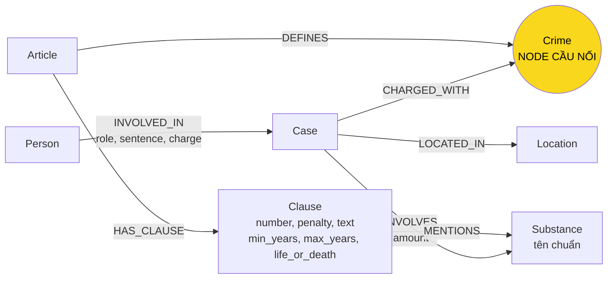

# Thiết kế Ontology — Day 19

**Họ tên:** Nguyễn Đức Thịnh  **MSSV:** 2A202602468

**Lựa chọn** (đánh dấu một):
- [ ] Dùng ontology gợi ý (có thể chỉnh nhỏ)
- [x] Tự thiết kế (xét bonus +15, xem `SUBMISSION.md`)

> Ontology này là **ontology mặc định** của `src/graph.py` (`KG_ONTOLOGY=own`). Ontology gợi ý vẫn chạy được qua `KG_ONTOLOGY=hint` để đối chiếu; file kết quả của nó là `ket_qua_benchmark_kg.hint.txt`.
> Giữ nguyên các label và quan hệ của gợi ý; chỉ thay đổi hai điểm có chủ đích (xem mục 6 và 7). Đổi tên label hoặc quan hệ sẽ không được tính bonus, nên không làm vậy.

## 1. Sơ đồ

Node cầu nối là `Crime` (màu vàng). Luật nối vào qua `DEFINES`, tin tức nối vào qua `CHARGED_WITH`. Khác với gợi ý: `Clause` có khung hình phạt có cấu trúc, và `Substance` có một tên chuẩn duy nhất.

## 2. Entity types (node labels)

Số lượng lấy từ graph của lần chạy benchmark ontology riêng (`ket_qua_benchmark_kg.txt`, 200 node). Khớp với `report/img/kg_count.png`.

| Label | Ý nghĩa | Khóa định danh (`MERGE` theo) | Properties | Lấy từ KB nào | Trích bằng (regex / LLM / khác) |
| --- | --- | --- | --- | --- | --- |
| `Article` (18) | Một Điều luật | `id` ("Điều 251 BLHS") | `title`, `law`, `doc_id` | luật | regex (`parse_law_article`) |
| `Clause` (99) | Một khoản của Điều | `id` ("Điều 251 BLHS khoản 1") | `number`, `penalty`, `text`, `doc_id`, **`min_years`, `max_years`, `life_or_death`** | luật | regex (`parse_law_article`, `parse_penalty`) |
| `Crime` (13) | Tội danh, **node cầu nối** | `name` (đã chuẩn hóa bằng `normalize_crime`) | không | luật (tiêu đề Điều) và tin (qua `link_entity`) | regex + `link_entity` |
| `Substance` (11) | Chất ma túy | `name` (**tên chuẩn**, qua `canonical_substance`) | không | cả hai | `find_substances` (luật), LLM rồi chuẩn hóa (tin) |
| `Case` (15) | Vụ việc trong một bài báo | `name` (do LLM đặt) | `summary`, `date`, `doc_id`, `source_title` | tin | LLM |
| `Person` (37) | Người liên quan đến vụ việc | `name` | `aliases` | tin | LLM |
| `Location` (7) | Tỉnh/thành nơi xảy ra vụ việc | `name` | không | tin | LLM |

Ghi chú: `Crime`, `Substance`, `Person`, `Location` không có `doc_id` vì là node dùng chung giữa nhiều tài liệu. Đây là trường hợp mà `bench_kg.py --build` in ra như hợp lệ.

`Clause.min_years`, `max_years`, `life_or_death` là `null` với khoản chỉ có phạt tiền hoặc cấm (ví dụ khoản 5 các Điều). `life_or_death` là `true` khi khung có "tù chung thân" hoặc "tử hình".

## 3. Relationships

| Type | Từ → Đến | Properties trên cạnh | Ý nghĩa |
| --- | --- | --- | --- |
| `HAS_CLAUSE` | Article → Clause | không | Điều có khoản |
| `DEFINES` | Article → Crime | không | Điều luật định nghĩa tội (cầu nối phía luật) |
| `MENTIONS` | Clause → Substance | không | Khoản nhắc tới chất (dùng để chọn khoản liên quan) |
| `CHARGED_WITH` | Case → Crime | không | Vụ việc bị truy tố tội (cầu nối phía tin) |
| `INVOLVES` | Case → Substance | `amount` | Vụ việc liên quan chất với khối lượng |
| `LOCATED_IN` | Case → Location | không | Vụ việc xảy ra ở đâu |
| `INVOLVED_IN` | Person → Case | `role`, `sentence`, `charge` | Người tham gia vụ việc, vai trò và mức án |

Tổng: 380 cạnh, gồm 7 loại như trên (cùng lần chạy benchmark).

## 4. Node cầu nối giữa 2 KB

- **Node nào:** `Crime`. Ví dụ `Crime {name: 'mua bán trái phép chất ma túy'}` có một cạnh `DEFINES` từ `Article 251 BLHS` và nhiều cạnh `CHARGED_WITH` từ các `Case` trong tin.
- **Vì sao chọn node này:** tội danh là thứ duy nhất vừa xuất hiện trong tiêu đề Điều luật (đã có sẵn, chuẩn), vừa được báo chí ghi lại trong bản án. Chất ma túy có nhiều tên gọi (ketamine/Ketamine, heroin/Heroine...), nên không đủ tin cậy làm cầu nối. Số tội danh cố định là 13 nên LLM có thể được cung cấp danh sách đầy đủ trong prompt.
- **Cách đảm bảo hai phía khớp tên:** (1) `normalize_crime` bỏ tiền tố "Tội", chữ thường, khoảng trắng thừa; (2) LLM được đưa danh sách tên chuẩn trong prompt; (3) mọi tội LLM trả về đều đi qua `link_entity` (khớp chính xác sau chuẩn hóa, rồi `difflib` với ngưỡng 0,8). Không khớp thì bỏ qua, không đoán.
- **Khi nào cầu gãy, và xử lý thế nào:**
  - Bài báo không nêu tội danh (ví dụ bài về một người bị bắt chưa có bản án). Kết quả: `Case` không có cạnh `CHARGED_WITH`. Hiện chưa xử lý; ghi nhận là một điểm yếu.
  - LLM nêu tội không có trong danh sách. `link_entity` trả `None` và tội bị bỏ, cầu gãy.
  - Cùng một vụ việc được tách thành hai `Case` do LLM đặt tên khác nhau ở hai bài. Một node có cầu, một node không. Ontology riêng **chưa** giải quyết lỗi này (xem mục 8). Lần chạy này có hai node Case cho Cái Quang Huy (xem `kg_my_case.png`: `Case (2)`).

## 5. Competency questions

Đường đi trên graph dùng để trả lời từng câu trong `data/benchmark_kg.json`.

| Câu | Đường đi (Cypher pattern) | Trả lời được? |
| --- | --- | --- |
| Q1 (tiền chất, PCMT) | `(Article {law:'Luật PCMT'})-[:HAS_CLAUSE]->(Clause)`: nội dung nằm trong `text` của khoản | Có, nhưng chỉ cần vector search. Graph không thêm gì |
| Q2 (tử hình, 36kg) | `(Person {role:'bị cáo'})-[:INVOLVED_IN {sentence:'tử hình'}]->(Case)-[:CHARGED_WITH]->(Crime)<-[:DEFINES]-(Article)` | Có. Tên người và mức án nằm trên cạnh và node |
| Q3 (Lê Minh Thành, 36 tháng, Điều 251) | `(Person {name:'Lê Minh Thành'})-[:INVOLVED_IN]->(Case)-[:CHARGED_WITH]->(Crime)<-[:DEFINES]-(Article {id:'Điều 251 BLHS'})-[:HAS_CLAUSE]->(Clause {number:1})` | Có. Đây là câu xuyên 2 KB điển hình |
| Q4 (Hoàng Nato, khung tối đa) | `(Person {name:'Dương Minh Tuấn'})-[:INVOLVED_IN]->(Case)-[:CHARGED_WITH]->(Crime)<-[:DEFINES]-(Article {id:'Điều 255 BLHS'})-[:HAS_CLAUSE]->(Clause {life_or_death:true})` | **Có** (từ khi thêm cận khung hình phạt). Khoản có `life_or_death` hoặc `max_years` lớn nhất là khung cao nhất (khoản 4: tù chung thân). Ontology gợi ý không trả lời được câu này |
| Q5 (Cái Quang Huy, MDMA, khoản 4 Điều 250) | `(Person {name:'Cái Quang Huy'})-[:INVOLVED_IN]->(Case)-[:INVOLVES {amount}]->(Substance {name:'MDMA'})<-[:MENTIONS]-(Clause)<-[:HAS_CLAUSE]-(Article {id:'Điều 250 BLHS'})` | **Một phần.** Chọn được các khoản nhắc MDMA (2, 3, 4) và khung cao nhất. Khớp khối lượng với ngưỡng vẫn phải đọc trong `text`. Vụ Cái Quang Huy có hai `Case`, chỉ một cái có `CHARGED_WITH` |
| Q6 (vụ việc có MDMA) | `(Case)-[:INVOLVES]->(Substance {name:'MDMA'})` | Đúng về Cypher (liệt kê được các vụ có MDMA). Pipeline GraphRAG chỉ mở rộng từ `doc_id` của top-k chunk nên không gom đủ vụ; lần chạy này đạt recall 0,67, lần trước 0 |

Tóm lại: Q1–Q4 trả lời đầy đủ bằng đường đi; Q5 trả lời một phần; Q6 đúng về Cypher nhưng pipeline không gom đủ.

## 6. Quyết định thiết kế và đánh đổi

1. **Dùng `Crime` làm cầu nối thay vì `Substance` hoặc `Article`.**
   - Phương án khác: cầu bằng `Substance` (chất có ở cả hai KB).
   - Vì sao chọn `Crime`: tội danh có danh sách chuẩn (13 mục) và luật định nghĩa trực tiếp tội. Chất có nhiều cách viết, nên cầu theo chất sẽ trùng và sai nhiều hơn.
   - Đánh đổi: Q6 (liệt kê theo chất) không đi qua cầu, phải dùng cạnh `INVOLVES` riêng.

2. **Trích luật bằng regex, tin bằng LLM.**
   - Phương án khác: dùng LLM cho cả hai KB.
   - Vì sao chọn: luật có cấu trúc đều (Điều → khoản → nội dung), regex cho kết quả cố định, không tốn token, không sai số giữa các lần chạy.
   - Đánh đổi: regex chỉ nhận khoản bắt đầu bằng `N. ` ở đầu dòng. Khoản "điểm" (a, b, c) không tách riêng, nên không mô hình hóa được ngưỡng khối lượng.

3. **Khung hình phạt có cấu trúc trên `Clause` (`min_years`, `max_years`, `life_or_death`).** *(thay đổi của ontology riêng)*
   - Phương án khác: giữ `penalty` là chuỗi văn bản (gợi ý), hoặc tách mỗi mức phạt thành một node `Penalty`.
   - Vì sao chọn: câu hỏi "tối đa" cần so sánh số năm, và so sánh trên chuỗi thì không làm được bằng Cypher. Thêm ba thuộc tính trên node đã có sẵn tốn ít hơn tách node mới, và không đổi label.
   - Đánh đổi: `parse_penalty` là regex, nên khung có cấu trúc phức tạp phải tự kiểm; khoản chỉ phạt tiền có `max_years = null`.

4. **Chuẩn hóa tên chất trước `MERGE` (`canonical_substance`).** *(thay đổi của ontology riêng)*
   - Phương án khác: để LLM tự đặt tên chất (gợi ý), hoặc gộp bằng LLM trong bước khác.
   - Vì sao chọn: khóa `MERGE` theo chuỗi thô làm `Ketamine`/`ketamine` thành hai node. Một bảng alias nhỏ và so khớp không phân biệt hoa thường đủ để gộp các trường hợp gặp phải, không tốn thêm lần gọi LLM.
   - Đánh đổi: chỉ gộp các biến thể đã biết (có trong `SUBSTANCES` và `SUBSTANCE_ALIASES`). Chất lạ như `etomidate` chỉ được viết hoa chữ cái đầu, không gộp với tên đồng nghĩa khác.

5. **Lấy khoản 1 + khoản nhắc chất của vụ, cộng thêm khoản khung cao nhất của mỗi Điều bị truy tố.**
   - Phương án khác: lấy toàn bộ khoản của Điều liên quan.
   - Vì sao chọn: giữ prompt ngắn. Khoản khung cao nhất được thêm vào vì câu hỏi "tối đa" cần nó, còn các khoản khác vẫn bị lọc.
   - Đánh đổi: thêm khoảng 500 token đầu vào trung bình mỗi câu (5.067 so với 4.573 của gợi ý, xem mục 7), tức tăng khoảng 11%.

## 7. So với ontology gợi ý (bắt buộc nếu xét bonus)

Bằng chứng lấy từ hai file kết quả, cùng code, cùng dữ liệu: `ket_qua_benchmark_kg.hint.txt` (gợi ý) và `ket_qua_benchmark_kg.txt` (riêng). Lưu ý LLM không hoàn toàn tất định: cùng ontology gợi ý, hai lần chạy cho graph recall 0,83 và 0,78; ontology riêng hai lần cho 0,83 và 0,94. Vì vậy chênh lệch về recall không đủ để kết luận; các điểm dưới đây được kiểm chứng bằng nhiều lần chạy và Cypher.

| Điểm khác | Gợi ý làm gì | Bạn làm gì | Vấn đề nó giải quyết | Bằng chứng (Cypher, hoặc số liệu benchmark) |
| --- | --- | --- | --- | --- |
| Khung hình phạt có cấu trúc trên `Clause` | `penalty` là chuỗi; "tối đa" không truy vấn được. Dữ kiện chỉ lấy khoản 1 và khoản nhắc chất, nên khoản 4 (chung thân) của Điều 255 bị bỏ | Thêm `min_years`, `max_years`, `life_or_death`; luôn thêm khoản khung cao nhất của mỗi Điều bị truy tố | **E2**: Q4 trả lời sai mức tối đa | Gợi ý: Q4 recall 0,67, judge 1 ở **cả hai** lần chạy ("tối đa 7 năm"). Riêng: Q4 recall 1,00, judge 2 ở **cả hai** lần chạy ("tối đa 20 năm hoặc tù chung thân"). Cypher: `MATCH (a:Article {id:'Điều 255 BLHS'})-[:HAS_CLAUSE]->(cl) RETURN cl.number, cl.max_years, cl.life_or_death` cho khoản 4 = `20, true`, các khoản còn lại `life_or_death = false` |
| Chuẩn hóa tên chất (`canonical_substance`) | Tên chất lấy nguyên từ LLM, nên một chất có nhiều node | Gộp theo tên chuẩn trước `MERGE`; bỏ từ chung chung như "ma túy" | **E3**: trùng `Ketamine`/`ketamine`, `Methamphetamine`/`methamphetamine` | Gợi ý: 16 node `Substance`, gồm cả hai cặp trùng. Riêng: 11 node ở **cả hai** lần chạy, không còn cặp trùng (`Amphetamine, Cocaine, Etomidate, Heroine, Ketamine, MDMA, Methamphetamine, XLR-11, côca, cần sa, thuốc phiện`). Tổng node: 205 → 200 |
| Kết quả Q4 trong benchmark | — | — | Competency question: ontology mới trả lời được câu mà gợi ý trả lời sai | Gợi ý Q4 judge 1 (sai mức tối đa); riêng Q4 judge 2 (đúng cả khung chung thân) |

Kết quả tổng hợp (cùng code, mỗi bên một lần chạy `--judge` trong file chính thức):

| | Gợi ý (`.hint.txt`) | Riêng (`.txt`) |
| --- | --- | --- |
| Graph recall (trung bình 6 câu) | 0,78 | 0,94 |
| Graph judge (0–2) | 1,67 | 1,83 |
| Graph USD mỗi câu | 0,00072 | 0,00081 |
| Graph input token mỗi câu | 4.573 | 5.067 |
| Số node / cạnh | 205 / 384 | 200 / 380 |

Điểm chưa cải thiện:
- **Q6** là giới hạn của pipeline (top-k chunk), không phải của ontology. Lần chạy riêng này đạt recall 0,67, nhưng lần chạy riêng trước đó đạt 0, nên không quy được cho ontology.
- **Q5** khớp khối lượng vẫn cần đọc văn bản khoản.
- **Lỗi trùng `Case`** của Cái Quang Huy vẫn còn (`Case (2)` trong `kg_my_case.png`; Q6 liệt kê vụ này hai lần).

## 8. Hạn chế còn lại

- **Trùng `Case`:** cùng một vụ có thể thành hai node khi LLM đặt tên khác nhau (ví dụ "Vụ vận chuyển ma túy của Cái Quang Huy" và "Vụ vận chuyển ma túy từ Đức về Việt Nam"). Một node có cạnh `CHARGED_WITH`, node kia thì không. Ontology riêng chưa xử lý; cách sửa đề xuất là gộp `Case` theo `(người chính, tội)` hoặc qua một bước LLM gộp vụ.
- **Chuẩn hóa chất chỉ theo bảng alias:** tên chất lạ không có trong `SUBSTANCES` hoặc `SUBSTANCE_ALIASES` vẫn có thể trùng.
- **Ngưỡng khối lượng** không được mô hình hóa. Q5 vẫn phải đọc văn bản khoản để chọn khoản theo khối lượng.
- **Không phân biệt giai đoạn tố tụng.** Cùng một người có thể là `bị can` ở bài này và `bị cáo` ở bài khác, mà graph không nối hai vai trò.
